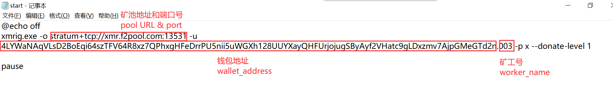

# XMR Miner
xmr mining application. it's based on [xmrig](https://github.com/xmrig/xmrig)-5.4.0 for windows/linux/docker.

## Windows

```sh
cd xmrig-5.4.0-win64

# run start.cmd in cli(like cmd or powershell).
```

you have to replace the pool/wallet/worker name to yours before runing this app.

example : `xmrig.exe -o stratum+tcp://xmr.f2pool.com:13531 -u 83j14db8zzaVarmQBmVXHZBnre8HKEi8QFh5p9fWnyzobSADaujKnwxN6ccEiFeLFXgGAsj2YvsTddJVQ3mukVg53fGUk77.colin -p x --donate-level 1
`



## Ubuntu
```sh
# 方式1：控制台运行
./xmrig-4.0-linux/start.sh

# 方式2：服务方式运行
sudo vi /etc/systemd/system/xmr.service
```

```conf
# xmr.service content

[Unit]
Description=XMR

[Service]
WorkingDirectory=/usr/local/xmr
ExecStart=/usr/bin/bash /usr/local/xmr/start.sh
Restart=always
RestartSec=10
KillSignal=SIGINT
SyslogIdentifier=xmr
User=colin

[Install]
WantedBy=multi-user.target
```
```sh
# service control
sudo systemctl enable xmr.service
sudo systemctl start xmr.service
sudo systemctl status xmr.service
sudo systemctl stop xmr.service
sudo systemctl restart xmr.service
```

you have to replace the pool/wallet/worker name to yours before runing this app.

example : `./xmrig -o xmr.f2pool.com:13531 -u 83j14db8zzaVarmQBmVXHZBnre8HKEi8QFh5p9fWnyzobSADaujKnwxN6ccEiFeLFXgGAsj2YvsTddJVQ3mukVg53fGUk77.colin -p x -k --donate-level 1`


## Docker
```sh
docker build -t colinchang/xmr:5.4.0 .
docker run -it -e pool='your mining pool' -e wallet='your wallet' -e worker='worker name' colinchang/xmr:5.4.0
```
 
```sh
# cpus can control how many cpu cores to use,be sure it's lower than cpu cores the computer and container owns.
docker run -it -e worker='colin' --cpus 3.6 colinchang/xmr:5.4.0
```

## CPU + GPU

RandomX optimizes CPU performance,all the mothods above are used CPU only for mining.

if you also wanna start mining with GPU,follow the guide below.

```sh
# for AMD GPU
./xmrig -o xmr.f2pool.com:13531 -u 83j14db8zzaVarmQBmVXHZBnre8HKEi8QFh5p9fWnyzobSADaujKnwxN6ccEiFeLFXgGAsj2YvsTddJVQ3mukVg53fGUk77.colin -p x -k --donate-level 1 --opencl

# for NVIDIA (CUDA10.1+ required)
./xmrig -o xmr.f2pool.com:13531 -u 83j14db8zzaVarmQBmVXHZBnre8HKEi8QFh5p9fWnyzobSADaujKnwxN6ccEiFeLFXgGAsj2YvsTddJVQ3mukVg53fGUk77.colin -p x -k --donate-level 1 --cuda
```
> CUDA : https://developer.nvidia.com/cuda-downloads?target_os=Linux

## Monitor

You may find detailed information about monitoring mining from the pool platform (like f2pool) you choose.

> official repository: https://github.com/xmrig/xmrig/releases

> f2pool guid: https://blog.f2pool.com/zh/mining-tutorial/xmr
